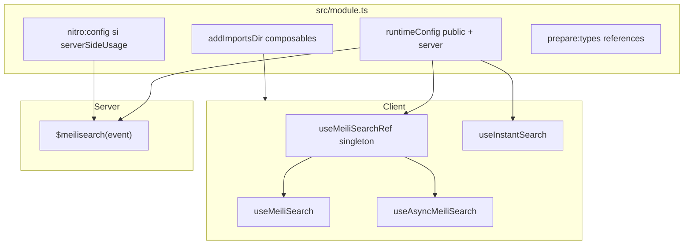
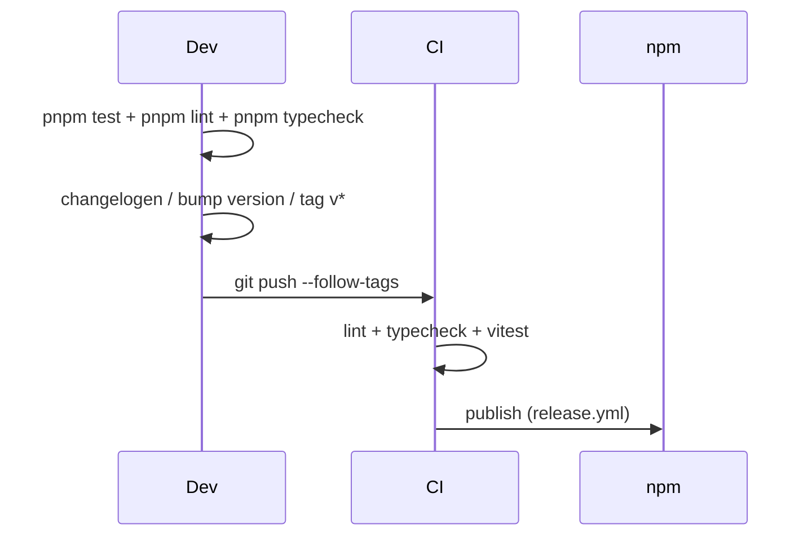

# Plan : suite de tests pour nuxt-meilisearch

## Contexte actuel

| Élément | État |
|---------|------|
| [`vitest`](package.json) + [`@nuxt/test-utils`](package.json) | Installés (v4.x) |
| Scripts `test` / `test:watch` | Déclarés mais **aucun fichier de test** |
| `vitest.config.ts` | Absent |
| CI (`.github/workflows/`) | Absent |
| Playground | Démo manuelle utile, mais dépend d’un Meilisearch live sur `:7700` |

Le module expose **4 composables**, **1 util serveur** (`$meilisearch`), et une config runtime via [`src/module.ts`](src/module.ts). Aucun plugin, composant, ni route serveur n’est injecté par le module lui-même.



## Stratégie de test (conforme aux skills nuxt / nuxt-modules)

Approche en **deux niveaux**, sans Meilisearch réel en CI (fiabilité release) :

1. **Tests d’intégration Nuxt (E2E légers)** — pattern officiel `@nuxt/test-utils/e2e` avec `setup()` + `$fetch` sur des fixtures minimales ([testing-and-publishing.md](.agents/skills/nuxt-modules/references/testing-and-publishing.md))
2. **Tests composables/runtime** — `@nuxt/test-utils/runtime` (`mountSuspended`) avec `vi.mock('meilisearch')` et `vi.mock('@meilisearch/instant-meilisearch')`

Le playground reste la démo manuelle ; les tests automatisés ne dépendent pas de Docker Meilisearch.

## 1. Infrastructure

### [`vitest.config.ts`](vitest.config.ts) (nouveau)

```ts
import { defineVitestConfig } from '@nuxt/test-utils/config'

export default defineVitestConfig({
  test: {
    environment: 'nuxt',
    include: ['test/**/*.test.ts'],
    setupFiles: ['test/setup.ts'],
  },
})
```

### [`test/setup.ts`](test/setup.ts) (nouveau)

- Mock global du client Meilisearch (`index().search()` retourne un `SearchResponse` stub)
- Mock `instantMeiliSearch` retournant un `{ searchClient: {} }` stub
- Reset des singletons module-level (`_meilisearchClient` dans [`src/runtime/server/utils/meilisearch.ts`](src/runtime/server/utils/meilisearch.ts)) entre tests si nécessaire

### [`test/helpers/meilisearch-mock.ts`](test/helpers/meilisearch-mock.ts) (nouveau)

Factory partagée pour configurer les réponses mock et espionner `search()`.

### Scripts [`package.json`](package.json)

- Ajouter `"typecheck": "pnpm test:types"` (le template CI nuxt-modules appelle `pnpm typecheck`, script absent aujourd’hui)
- Ajouter `"test:ci": "pnpm dev:prepare && vitest run"` pour reproduire le pipeline local
- Optionnel : `"test:coverage": "vitest run --coverage"` + devDep `@vitest/coverage-v8` si vous voulez un rapport de couverture

**Aucune nouvelle librairie majeure requise** — `@nuxt/test-utils` + `vitest` suffisent. Seul `@vitest/coverage-v8` est optionnel.

**Prérequis local/CI** : `pnpm dev:prepare` avant les tests (stub build + types `.d.ts` générés pour [`nuxtMeilisearch.d.ts`](src/runtime/types/nuxtMeilisearch.ts) référencé par le module).

## 2. Fixtures Nuxt (`test/fixtures/`)

Trois apps minimales, chacune avec `nuxt.config.ts` important le module depuis `../../../src/module` :

| Fixture | Config module | Rôle |
|---------|---------------|------|
| `basic/` | `hostUrl` + `searchApiKey`, `serverSideUsage: false` | Composables client |
| `server/` | `serverSideUsage: true` + `adminApiKey` | Auto-import `$meilisearch` |
| `instant/` | `instantSearch: { theme: 'satellite' }` | Transpile + CSS theme |

Chaque fixture inclut des **routes de sonde** (pas de pages UI lourdes) :

- `server/api/config.get.ts` — expose `runtimeConfig.public.meilisearchClient` pour valider le merge `defu` du module
- `server/api/search.get.ts` — appelle `useMeiliSearch` ou `$meilisearch(event)` et retourne le résultat mocké
- `app.vue` minimal pour les tests `mountSuspended`

Config runtime de test (valeurs fictives, jamais de vraies clés) :

```ts
meilisearch: {
  hostUrl: 'http://meilisearch.test',
  searchApiKey: 'test-search-key',
  adminApiKey: 'test-admin-key',
  serverSideUsage: true, // fixture server uniquement
}
```

## 3. Fichiers de tests

### [`test/module.test.ts`](test/module.test.ts) — setup du module

Via fixture `basic` + `$fetch('/api/config')` :

- `hostUrl`, `searchApiKey`, `serverSideUsage`, `instantSearch` correctement mergés dans `runtimeConfig.public.meilisearchClient`
- `defu` ne écrase pas une valeur runtimeConfig pré-existante (test avec override dans fixture)
- Warning console si `hostUrl` / `searchApiKey` manquants (fixture `minimal/` sans clés, spy `console.warn`)

Via fixture `instant` :

- `nuxt.options.css` contient `instantsearch.css/themes/satellite.css` (inspect via route ou build metadata si nécessaire)

Via fixture `server` :

- Route serveur peut appeler `$meilisearch(event)` sans import explicite (auto-import Nitro preset)

### [`test/composables/useMeiliSearchRef.test.ts`](test/composables/useMeiliSearchRef.test.ts)

- Crée un client `MeiliSearch` avec `host` + `apiKey` du runtimeConfig
- Deux appels retournent la **même instance** (`nuxtApp._meilisearchClient`)

### [`test/composables/useMeiliSearch.test.ts`](test/composables/useMeiliSearch.test.ts)

- Throw si `index` vide : message `` `[nuxt-meilisearch]` Cannot search without `index` ``
- `search()` appelle `client.index(index).search(query, params)`
- `result` (useState) est mis à jour avec la réponse mock

### [`test/composables/useAsyncMeiliSearch.test.ts`](test/composables/useAsyncMeiliSearch.test.ts)

- Throw si `index` vide
- Clé `useAsyncData` = `` `${index}-async-search-result` ``
- Retourne les données mockées (assertion sur `.data`, pas cast `T` seul)

### [`test/composables/useInstantSearch.test.ts`](test/composables/useInstantSearch.test.ts)

- Singleton `nuxtApp._instantSearchClient`
- `instantMeiliSearch(hostUrl, searchApiKey)` appelé une seule fois

### [`test/server/meilisearch.test.ts`](test/server/meilisearch.test.ts)

Via fixture `server` + `$fetch('/api/search')` :

- `$meilisearch(event)` lit `runtimeConfig.serverMeilisearchClient.adminApiKey`
- Client singleton module-level (documenter le comportement actuel lignes 5–16 de [`meilisearch.ts`](src/runtime/server/utils/meilisearch.ts))

### [`test/e2e/fixtures.test.ts`](test/e2e/fixtures.test.ts)

Smoke tests E2E par fixture :

```ts
await setup({ rootDir: fileURLToPath(new URL('../fixtures/basic', import.meta.url)) })
const config = await $fetch('/api/config')
expect(config.hostUrl).toBe('http://meilisearch.test')
```

## 4. CI GitHub Actions (gate release)

Créer [`.github/workflows/ci.yml`](.github/workflows/ci.yml) d’après le template [ci-workflows.md](.agents/skills/nuxt-modules/references/ci-workflows.md) :

```yaml
- run: pnpm install
- run: pnpm dev:prepare
- run: pnpm lint
- run: pnpm typecheck   # alias vers test:types
- run: pnpm test
```

**Branche par défaut** : vérifier si le repo utilise `main` ou `master` et aligner le workflow.

Optionnel mais recommandé pour le flux release décrit dans le skill :

- [`.github/workflows/release.yml`](.github/workflows/release.yml) — déclenché sur tag `v*`, attend la CI (`wait-on-check-action`), puis publish npm
- Adapter le script `"release"` actuel (`changelogen && pnpm publish`) pour que le publish passe par CI plutôt qu’en local

## 5. Corrections mineures connexes

- [`playground/types.d.ts`](playground/types.d.ts) référence des fichiers inexistants — corriger ou supprimer pour que `pnpm test:types` ne casse pas en CI
- Régénérer `pnpm-lock.yaml` (supprimé dans le working tree) via `pnpm install` avant la première exécution CI

## 6. Flux release cible



## Ordre d’implémentation

1. `vitest.config.ts` + `test/setup.ts` + mocks
2. Fixture `basic/` + premier test E2E config
3. Tests composables (4 fichiers)
4. Fixture `server/` + test `$meilisearch`
5. Fixture `instant/` + test CSS/transpile
6. Tests warnings module (`minimal/`)
7. `.github/workflows/ci.yml` + script `typecheck`
8. Fix `playground/types.d.ts` + regénération lockfile

## Critères de succès

- `pnpm test` passe en local sans Meilisearch running
- `pnpm test:ci` reproduit le pipeline complet
- CI bloque merge/PR si tests, lint ou types échouent
- Chaque composable exporté et `$meilisearch` ont au moins un test de comportement nominal + un test d’erreur (index manquant / config manquante)
