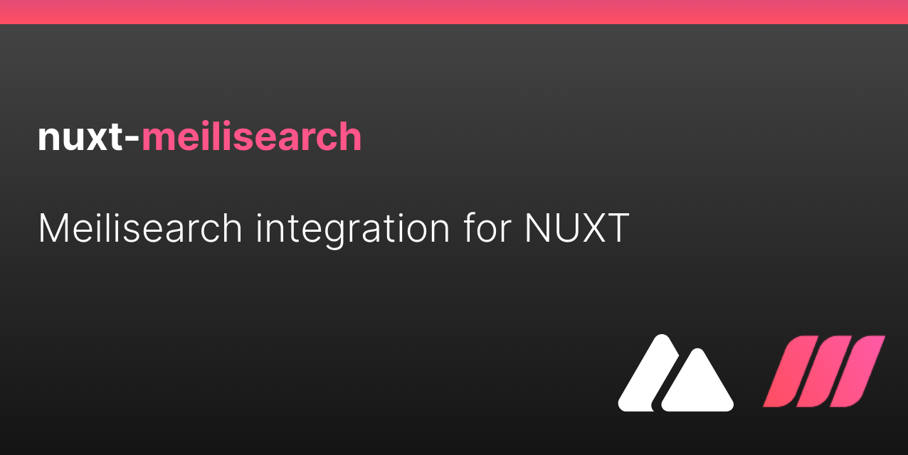

# Nuxt-Meilisearch

<!-- Badges -->
<!-- [![npm version][npm-version-src]][npm-version-href]
[![npm downloads][npm-downloads-src]][npm-downloads-href]
[![License][license-src]][license-href] -->

[Meilisearch](https://www.meilisearch.com/) module for [Nuxt](https://v3.nuxtjs.org/)

## Features

 - Nuxt 3
 - Easy integration with [MeilisearchJS lib](https://github.com/meilisearch/instant-meilisearch)
 - Support for Vue [Algolia Vue 3 Instantsearch](https://github.com/algolia/vue-instantsearch) components ( optional ) 

 ## Setup 

 Install nuxt-meilisearch !

 ```bash
npm install nuxt-meilisearch  // yarn add nuxt-meilisearch
 ```

Add it to the modules section of nuxt.config.ts

 ```javascript[nuxt.config.js]
{
 ...
  modules: [
    'nuxt-meilisearch'
  ],
  meilisearch: {
    hostUrl: '<YOUR_MEILISEARCH_HOST_URL>',
    apiKey: '<YOUR_MEILISEARCH_API_KEY>',
    instantSearch: true // default true
  }
  ...
}
```

## Usage

You can load Meilisearch client with composables 

```javascript
<script setup>

const client = useMeilisearchClient();

</script>

```

Then is your template you can use all [Algolia Vue 3 Instantsearch](https://github.com/algolia/vue-instantsearch) components. 

Exemple: 

```html
<template>
  <div>
    Nuxt module playground for nuxt-meilisearch !

    <ais-instant-search
      :search-client="client"
      index-name="movies"
    >
      <ais-configure :hits-per-page.camel="10" />
      <ais-search-box
        placeholder="Search here…"
        class="searchbox"
      ></ais-search-box>
      <ais-hits>
        <template v-slot="{ items }">
          <ul>
            <li
              v-for="{id,title,poster} in items"
              :key="id"
            >
              <h1>{{ title }}</h1>
              
            </li>
          </ul>
        </template>
      </ais-hits>

    </ais-instant-search>
  </div>
</template>
```


## Roadmap

- [x] Init - Open github repo
- [x] Main Meilisearch JS client
- [x] Load options in single object
- [x] Move inject via composables instead of plugin
- [x] Conditional algolia vue3 lib , default true
- [x] Publish NPM
- [ ] Use client from SERVER side to manipulate items
- [ ] Nice demo site
  - [ ] meilisearch instance from cloud
  - [ ] publish on netlify
- [ ] Create Docs site ( docus ) then publish
- [ ] Demo on StackBlitz for quick hack

## Development

- Run `npm run dev:prepare` to generate type stubs.
- Use `npm run dev` to start [playground](./playground) in development mode.

## Licence

[MIT Licence](./LICENCE)


<!-- Badges -->

<!-- [npm-version-src]: https://img.shields.io/npm/v/@nuxtjs/partytown/latest.svg
[npm-version-href]: https://npmjs.com/package/@nuxtjs/partytown
[npm-downloads-src]: https://img.shields.io/npm/dm/@nuxtjs/partytown.svg
[npm-downloads-href]: https://npmjs.com/package/@nuxtjs/partytown
[github-actions-ci-src]: https://github.com/nuxt-community/partytown-module/workflows/ci/badge.svg
[github-actions-ci-href]: https://github.com/nuxt-community/partytown-module/actions?query=workflow%3Aci
[codecov-src]: https://img.shields.io/codecov/c/github/nuxt-community/partytown-module.svg
[codecov-href]: https://codecov.io/gh/nuxt-community/partytown-module
[license-src]: https://img.shields.io/npm/l/@nuxtjs/partytown.svg
[license-href]: https://npmjs.com/package/@nuxtjs/partytown -->
