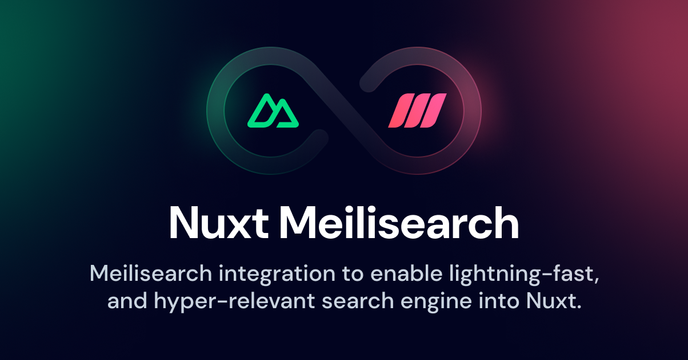

[](https://nuxt-meilisearch.vercel.app/)

<p align='center'>

[](https://www.npmjs.com/package/nuxt-meilisearch) [](https://www.npmjs.com/package/nuxt-meilisearch)
[](https://twitter.com/xlanex6)

</p>

# Nuxt Meilisearch

Integrate [Meilisearch](https://meilisearch.com/?utm_campaign=oss&utm_source=github&utm_content=nuxt-meilisearch) fast and hyper-relevant search engine in your [Nuxt](https://nuxt.com) application.

Read [Nuxt Meilisearch documentation](https://nuxt-meilisearch.vercel.app).

## Features

- Nuxt 3 integration
- Auto-imported composables
- Server-side rendering support
- Client & server integration of Meilisearch
- Full TypeScript support
- Compatible with [Instant Meilisearch](https://github.com/meilisearch/instant-meilisearch)
- Vue [Algolia InstantSearch](https://github.com/algolia/instantsearch) components (optional)

## Installation

Install nuxt-meilisearch:

```bash
# with npm
npm install nuxt-meilisearch

# with yarn
yarn add nuxt-meilisearch

# with pnpm
pnpm add nuxt-meilisearch
```

> [!WARNING]
> v1.0 introduced a breaking change on the module configuration options.

Then, update your `nuxt.config.ts`:

 ```ts{}[nuxt.config.ts]
export default defineNuxtConfig({
  modules: [
    'nuxt-meilisearch'
  ],
  meilisearch: {
    hostUrl:  '<your_meilisearch_host>', //required
    searchApiKey: '<public_search_api_key>', // required
    adminApiKey: '<admin_api_key>', // optional
    serverSideUsage: true // default: false
})
```

## Usage

This example performs a search in the `books` index:

```html{}[pages/index.vue]
<script setup>
const { search, result } = useMeiliSearch('books')

onMounted(async () => {
  await search('harry');
})
</script>

<template>
  <div>
    {{ result }}
  </div>
</template>
```

Learn more in the [Nuxt Meilisearch documentation](https://nuxt-meilisearch.vercel.app).

## Contributing

Issues and pull requests are welcome. 🫶

**Local development**

- Run `npm run dev:prepare` to generate type stubs.
- Use `npm run dev` to start [playground](./playground) in development mode.

## Licence

[MIT Licence](./LICENCE)


<!-- Badges -->

<!-- [npm-version-src]: https://img.shields.io/npm/v/@nuxtjs/partytown/latest.svg
[npm-version-href]: https://npmjs.com/package/@nuxtjs/partytown
[npm-downloads-src]: https://img.shields.io/npm/dm/@nuxtjs/partytown.svg
[npm-downloads-href]: https://npmjs.com/package/@nuxtjs/partytown
[github-actions-ci-src]: https://github.com/nuxt-community/partytown-module/workflows/ci/badge.svg
[github-actions-ci-href]: https://github.com/nuxt-community/partytown-module/actions?query=workflow%3Aci
[codecov-src]: https://img.shields.io/codecov/c/github/nuxt-community/partytown-module.svg
[codecov-href]: https://codecov.io/gh/nuxt-community/partytown-module
[license-src]: https://img.shields.io/npm/l/@nuxtjs/partytown.svg
[license-href]: https://npmjs.com/package/@nuxtjs/partytown -->

<!--
For Meilisearch DEmo
exemple valid MASTER_KEY
`PZKj1rFXYBnjLzEIxXRRaEz3gNDWTG3JoW6ZDzd6-mo`

```bash
docker run -it --rm \
  -p 7700:7700 \
  -e MEILI_MASTER_KEY='PZKj1rFXYBnjLzEIxXRRaEz3gNDWTG3JoW6ZDzd6-mo'\
  -v $(pwd)/meili_data:/meili_data \
  getmeili/meilisearch:v1.5
``` -->
